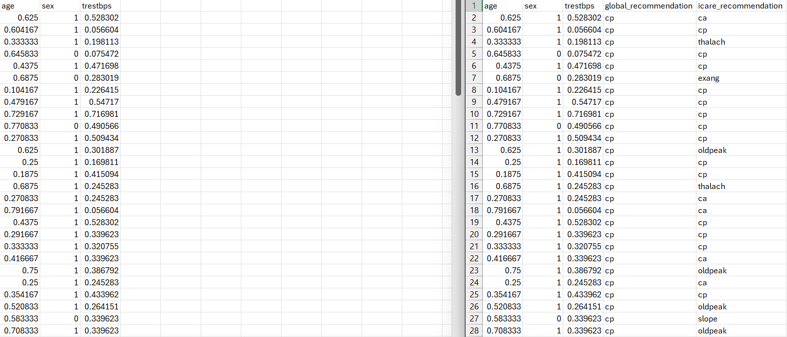
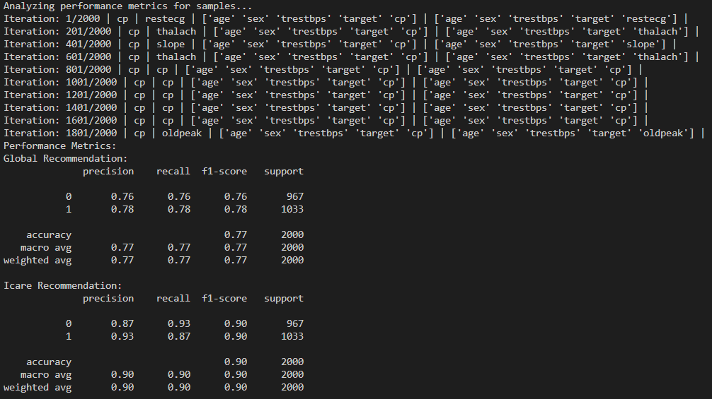
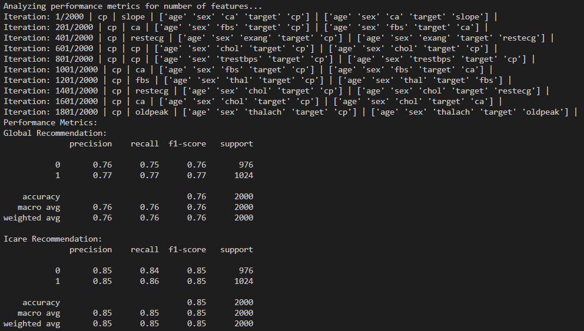

# iCARE

This code package implements the iCARE framework from the paper "Individualized Machine-learning-based Clinical Assessment Recommendation System (iCARE)". Code to generate the synthetic dataset highlighted in the paper are provided in /Synthetic Dataset/.

Prerequisites: Pandas, NumPy, SHAP (SHapley Additive exPlanations), Scikit-learn (requirements.txt)

## Instructions for generating recommendations:
1. Run the following: main.py generate [df1 file path] [df2 file path] [y_col] [output file path]
   - e.g: main.py generate "Sample Dataset/pool_of_known_cases.csv" "Sample Dataset/samples.csv" "target" "Sample Dataset/samples_with_recommendations.csv"
   - [df1 file path] is the file path of the pool of known cases which is the dataset that contains information from past assessments
   - [df2 file path] is the file path of the dataset that contains information of incoming patients
   - NOTE: [df2 file path] column names must be consistent with [df1 file path] column names. (Meaning [df2 file path] contain column names that are subset of [df1 file path])
   - [y_col] is the name of the target column in [df1 file path]
   - [output file path] is the file path for the dataset that contains the incoming patients with recommendations given

Sample Output:

---
  
## Instructions for analyzing sample (Does the feature subset x1, ..., xi benefits from iCARE recommendations):
1. Run the following: main.py analyze_sample [df1 file path] [df2 file path] [y_col] [iteration]
   - e.g: main.py analyze_sample "Sample Dataset/pool_of_known_cases.csv" "Sample Dataset/samples.csv" "target" 2000
   - [df1 file path] is the file path of the pool of known cases which is the dataset that contains information from past assessments
   - [df2 file path] is the file path of the dataset that contains information of incoming patients
   - NOTE: [df2 file path] column names must be consistent with [df1 file path] column names. (Meaning [df2 file path] contain column names that are subset of [df1 file path])
   - [y_col] is the name of the target column in [df1 file path]
   - [iteration] is the number of times a random sample representing incoming patients are created and evaluated
     
We analyze whether a sample with features x1, ..., xi can benefit from iCARE recommendations. This is achieve by the following steps:
1. Take a sample from the pool of known cases dataset and prune the features so it only has the feature x1, ..., xi.
2. Generate global and iCARE recommendations
3. Append the recommended feature to the sample and make prediction
4. Repeat until iteration number is achieved
5. Generate performance summary comparing global and iCARE recommendations

Sample Output:

---

## Instructions for analyzing feature space (Does incoming patients with x number of initial features benefit from iCARE recommendations):
1. Run the following: main.py analyze_feature [df1 file path] [y_col] [number_of_feature] [static_features] [iteration]
   - e.g: main.py analyze_feature "Sample Dataset/pool_of_known_cases.csv" 3 "target" "age,sex" 2000
   - [df1 file path] is the file path of the pool of known cases which is the dataset that contains information from past assessments
   - [y_col] is the name of the target column in [df1 file path]
   - [number_of_feature] is the number of initial feature the random sample is going to contain
   - [static_features] is a list of user-defined features that the sample must have
   - i.e: number_of_feature = 4 and static_feature = age,sex means that the random sample created will always contain [age,sex] initial feature and 2 randomly selected features for a total of 4 features
   - [iteration] is the number of times a random sample representing incoming patients are created and evaluated
     
We analyze whether a sample with x number of initial features benefit from iCARE recommendations. This is achieve by the following steps:
1. Take a sample from the pool of known cases dataset and prune the features so it only has x number of randomly selected initial feature (if static_feature is given, those feature will always be included)
2. Generate global and iCARE recommendations
3. Append the recommended feature to the sample and make prediction
4. Repeat until iteration number is achieved
5. Generate performance summary comparing global and iCARE recommendations

Sample Output:

